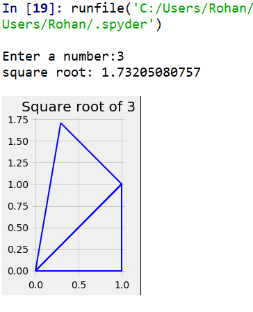
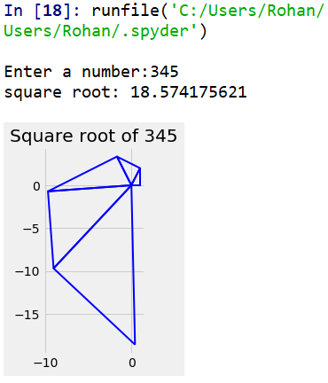
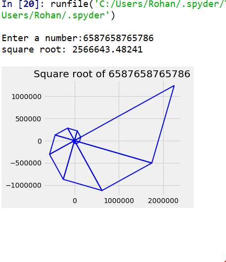

# SquareRoot

This project explores how triangles can be used to find the square root of a number.

## Old readme

### Prerequisites

- Python 3
- matplotlib

```
pip install matplotlib
```

## The Idea

The basic idea of this is to find the square root of a number using the pythagoras theorem. In the result, the square root of the given number will be the hypotenuse of the last triangle.If the number is not a pythagorean triplet, one side can be expressed as a natural number and the other is the hypotenuse of ANOTHER triangle, and so on.Look at the examples below.

|        (a)         | (b)                |        (c)         |
| :----------------: | ------------------ | :----------------: |
|  |  |  |

As seen in (a), the value of root(3) is the length of the hypotenuse of a right angled triangle with one side "1", and the other side root(2). Root(2) is itself calculated by measuring the hypotenuse of another triangle with with sides "1" each.

This gives a brief idea of how it works. (b) and (c) provide more examples.
In all cases, the length of the hypotenuse of the last triangle is the value of the square root of the desired number.

## Acknowledgments

- A part of the algorithm was based from [here](https://math.stackexchange.com/questions/2125690/find-coordinates-of-3rd-right-triangle-point-having-2-sets-of-coordinates-and-a)
- Shout out to my buddy pythagoras
